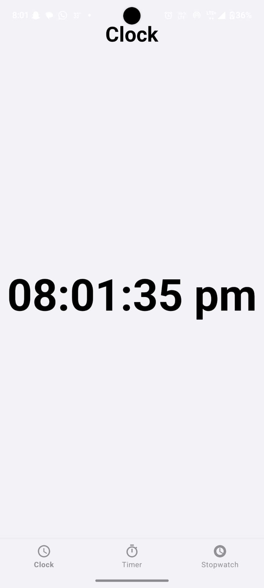
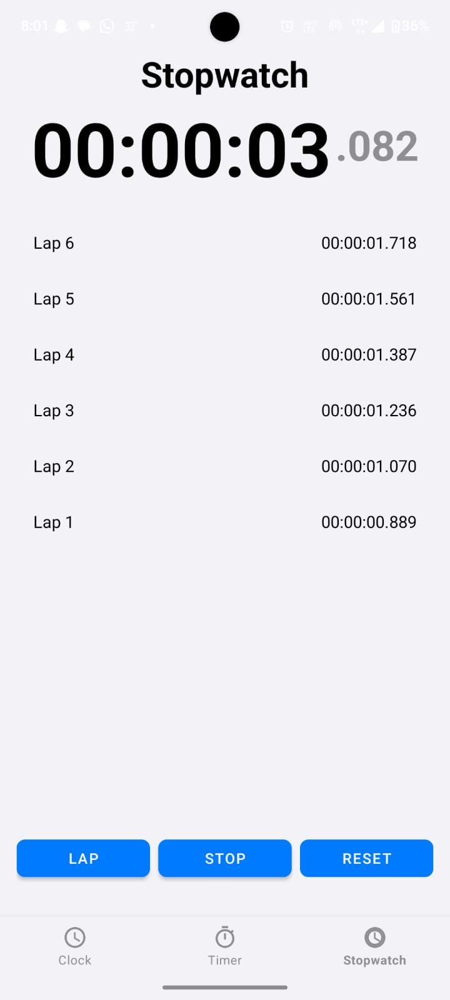
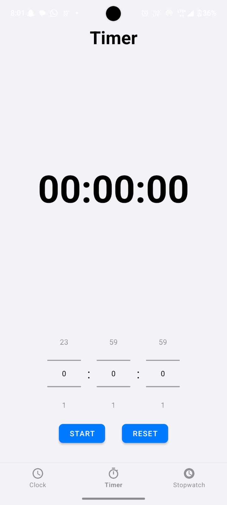

# 🕒 AI-Powered Clock App

A beautiful, minimalistic **Clock App** that includes a **Clock**, **Timer**, and **Stopwatch** — all built using **Kotlin** and **XML** with the help of **Cursor AI**.  
This app was developed **without typing a single line of code manually**, showcasing how **AI tools can amplify human effort** and open new possibilities for building software more effectively.

---

## 🌟 Features

- 🕰️ **Clock** – View current system time in a sleek design.
- ⏱️ **Stopwatch** – Track time precisely with start, pause, and reset functionality.
- ⏳ **Timer** – Set and manage countdowns effortlessly.
- 🎨 **Clean UI** – Focused on clarity, usability, and aesthetic design.
- 🤖 **AI-Powered Development** – Built entirely using **Cursor AI** – no manual typing involved.

---

## 📱 Screenshots

  
  
  

---

## 📲 Download the App

🎉 **Try out the AI-Powered Clock App on your Android device!**

**Click download link**

 

  

> No Play Store needed – just download, install, and enjoy the clean UI experience!
> 💡 Tip: Enable "Install from unknown sources" in your phone settings if needed.

---

## 🛠 Tech Stack

- **Kotlin** – Modern Android programming language
- **XML** – Declarative layout design
- **Cursor AI** – AI-powered code generation
- **Android Studio** – IDE for development

---
## 💡 Purpose of This Project

This project is not just about creating a clock —  
It's about showing the **future of software development**.

> _"AI doesn't replace developers, it empowers them."_

With this app, I aim to:

- Prove that you can build a functional and elegant Android app **without typing a single word**.
- Highlight the potential of tools like **Cursor AI** to rapidly turn ideas into fully working applications.
- Inspire developers to embrace AI as a **creative partner**, not a shortcut.

---

## 🙌 Acknowledgements

- **[Cursor AI](https://www.cursor.so/)** – for enabling AI-powered development  
- **[JetBrains – Kotlin](https://kotlinlang.org/)** – for a clean, concise programming language  
- **[Android Developers](https://developer.android.com/)** – for tools, docs, and support  
- Inspired by the **minimalist iOS-style clock** design

---

## 👨‍💻 Developer

**Lalit Sharma**  

- 🔗 [GitHub](https://x.com/nischayyy_y)
- 💼 [LinkedIn](https://www.linkedin.com/in/lalit-sharma-x/)
- 🌐 [Portfolio](https://www.lalitsharma.framer.website/)

---

## ⭐ Show Some Love

If you enjoyed this project:

- Leave a ⭐ on [GitHub](https://github.com/lalit876)
- Share it with your dev circle
- Keep building with AI-powered creativity 🚀

